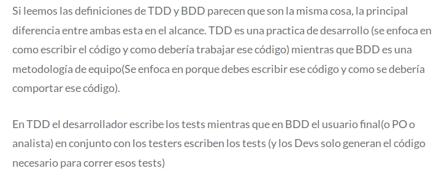
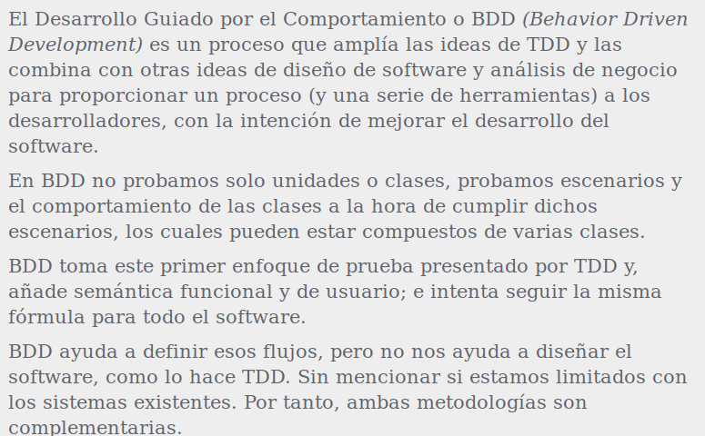
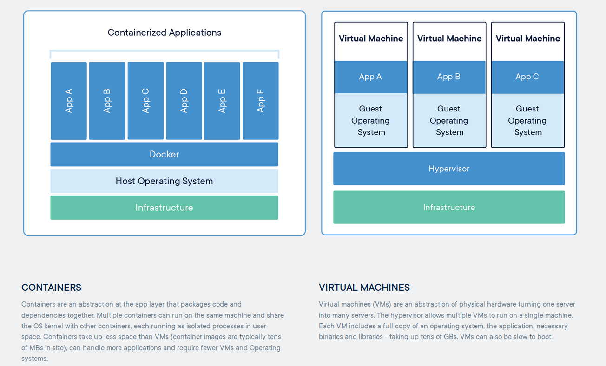
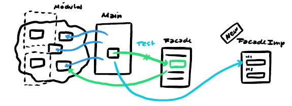

# Final aseguramiento - práctica
## Técnicas a lo largo del tiempo
- Debugging
- Demonstration
- Destruction
- Evaluation
- Prevention

## TDD
Escribir el código de test antes que el productivo.

Los tests no deben ser dependientes de otros tests. Se deberían poder ejecutar de forma random.

Deben ser atómicos. Solo se debe testear una única funcionalidad.

**Suite de tests**: tests de una misma clase.

No garantiza un buen diseño pero si garantiza un diseño menos acoplado.

Otras formas de testing:
- Test de integración: antes del deploy -> testear con el sistema real
- Simulador: durante el desarrollo -> los test tienen que ser rápidos.

**Importante**: Los tests deben testear qué es lo que hace no cómo lo hace

No hacer tests de caja blanca que requieren conocer la implementación del método para poder testear

**White-box testing**: el test se basa en la estructura del código terminado.

**Black-box testing**: el test se basa en la funcionalidad deseada de la implementación es decir, su especificación o requerimientos.

### Pasos a seguir al desarrollar siguiendo los principios de TDD
> 1. Quickly add a test
> 2. Run all tests and see the new one fail
> 3. Make a little change
> 4. Run all tests and see them all succeed
> 5. Refactor to remove duplication  
>
>\- Kent Beck | Test-Driven Development by example

### Nombre
- **Test001_**
- **ASpeedValue** -> sujeto
- **When**
- **IncreasePercent** -> estímulo
- **Should**
- **UpdateValue()** -> Situación final (resultado)

### Dependencias
Inyectamos las dependencias. La dependencia debería estar explicita.

Encapsulamos comportamiento externo -> podemos hacer objectos que simulan el real. Tenemos control sobre cada situación posible que queramos testear.

Colaborador interno -> lo conoce siempre

Colaborador externo

---
## Agile methods
- Scrum
- Lean: eliminar desperdicio
- Kanban
  - Tablero, tareas fluyen de izquierda a derecha
  - Varios estados. Ningún estado se debe saltear. Algún estado puede tener un cant. máxima de tareas
  - Tarjetas pueden tener una estimación de esfuerzo
  - Fomenta el code review
- XP
  - Definición de requerimientos (US)
  - Metáforas de arquitecturas. Decisiones que hay que tomar de arquitectura
    - Se pueden hacer prototipos que luego se desechan.

### User Story Mapping
Planning de alto nivel

Descubrimiento del proyecto

Define el backbone del proyecto. Narramos la historia del sistema -> Map the Big Picture.

- Definir la misión del proyecto
- Definir objectivos
- Armar un resumen ejecutivo -> definir what, who y what

**Dev team task breakout**: dividir user stories en tasks. Las tasks estan asignadas a un desarrollador -> estimar cuanto tiempo van a tomar las tasks.

UAT: user acceptance test. Proceso para verificar que la solución funciona para el usuario.

---
## E2E Testing
### Cypress

- Pro's
  - browser embedded
  - Shortcuts "You no longer have to use your UI to build up state"
  - Flake resistant "same app loop, sync"
  - Debuggability
- Permanent trade-offs:
  - Cypress is not a general purpose automation tool => e2e ui functional testing
  - Cypress commands run inside of a browser => it makes it a little bit harder to communicate with the backend
  - There will never be support for multiple browser tabs => por target blank hace otro test para esa url
  - You cannot use Cypress to drive two browsers at the same time
  - Each test is bound to a single origin => limited to only visiting a single superdomain, de primer orden

Formato:
- Context
  - Describe
    - it

Stubbing the server
- cy.server() -> enable response stubbing
- cy.route(method, url, response)
- cy.request() -> no se muestran en la network tab.

**cy.readFile()**: para hacer "dinamic" un test

**cy.task()**: Node code outside of the scope of Cypress.

**cy.exec**: igual al anterior pero en console en vez de nodejs.

### TDD vs BDD



### CircleCI
Integración continua.

```yaml
version: 2.1
orbs:
  cypress: cypress-io/cypress@1
workflows:
  build:
    jobs:
      - cypress/run:
          start: npm start
          wait-on: 'http://localhost:3000'
```

---
## Docker

### Containers vs VM


El container persiste y tiene su propio file system.  
Los containers comparten:
- Kernel
- Acceso a red
- CPU
- RAM

Compiten por estos recursos.

### Infraestructura inmutable
Se tiene que publicar una nueva versión.  
Borrar el servicio viejo y empieza uno nuevo.

### Ejemplo
``` Dockerfile
# Pull core image
FROM mcr.microsoft.com/dotnet/core/sdk:2.2 AS publish

# Define la variable de entorno DB_SERVER con localhost como su valor default
ENV DB_SERVER localhost

# Install git, clone the repository and compile the project
RUN \
  apt install git && \
  git clone https://github.com/Tomas-Perez/acs.git && \
  cd acs/acs && \
  dotnet publish acs.csproj -c Release -o /app

# Pull runtime image  
FROM mcr.microsoft.com/dotnet/core/runtime:2.2

# Directorio de trabajo al iniciar el container
WORKDIR /app

# Puerto expuesto
EXPOSE 1234

# Copia el directorio /app de la imagen base a la nueva imagen
COPY --from=publish /app .

# Comando a ejecutar cuando empieza el container
ENTRYPOINT dotnet acs.dll $DB_SERVER
```
La imagen `core` no es necesaria cuando el proyecto ya está compilado, por lo que utilizamos únicamente el `runtime` (ya que pesa mucho menos).

Referencia de Dockerfile https://docs.docker.com/engine/reference/builder/

Todos los containers de un docker compose corren en un mismo nodo.

### Cluster managers
 - Docker-swarm (variar docker machine)
   - docker machine: una máquina remota
 - Mesos
 - Kubernetes
 - Openshift
 - Rancher

---
## Continuos Integration
Integrar el código de manera constante.  
Ante cada commit correr jobs automáticos que validan la "salud" del código.

### Jenkins
https://jenkins.io/doc/
>Jenkins is a self-contained, open source automation server which can be used to automate all sorts of tasks related to building, testing, and delivering or deploying software.

**Jenkins pipeline**  
https://jenkins.io/doc/pipeline/tour/hello-world/
>Jenkins Pipeline (or simply "Pipeline") is a suite of plugins which supports implementing and integrating continuous delivery pipelines into Jenkins.  
A continuous delivery pipeline is an automated expression of your process for getting software from version control right through to your users and customers.  
Jenkins Pipeline provides an extensible set of tools for modeling simple-to-complex delivery pipelines "as code". The definition of a Jenkins Pipeline is typically written into a text file (called a Jenkinsfile) which in turn is checked into a project’s source control repository

### Circle-ci

---
## Continuos development

### Spinnaker
https://www.spinnaker.io/concepts/

**Application Manager**
>You use Spinnaker’s application management features to view and manage your cloud resources.
- Application: Clusters + load balancer + firewall
- Cluster: conjunto de server groups
- Server Group: deployable artifact
- Load Balancer: balancea el trafico hacia los server groups
- Firewall: da acceso a un rango de ips.

**Application Manager**
>You use Spinnaker’s application deployment features to construct and manage continuous delivery workflows.
- Pipeline: secuencia de acciones (stages). Puede ser ejecutada automáticamente con un evento (new docker image, jenkins job completing)
- Stage: atomic building block (Deploy, Resize, Disable, Manual Judgment, etc..)
- Deployment strategies

**Manual judgement**
>Manual Judgments serve as a gate for your pipeline. You can add manual judment stages to interrupt the pipeline execution to run a manual check. This is great for teams that have a manual or out-of-band QA process.

## Regression test
https://en.wikipedia.org/wiki/Regression_testing
>Regression testing is re-running functional and non-functional tests to ensure that previously developed and tested software still performs after a change. If not, that would be called a regression. Changes that may require regression testing include bug fixes, software enhancements, configuration changes, and even substitution of electronic components

---
## Locust
Tipos de tests:
- Stress: carga > peak y sostenido
  - Se busca romper la aplicación para ver cunto soporta
- Load: De carga media a peak esperado. Ida y vuelta.
- Performance: identificar los recursos necesarios con carga media.
  
**KPI**: key performance indicators. Dependen de la aplicación y de la arquitectura.
- Tiempo de respuesta
- Storage  

### Locust .io
- Python
- Docker
- Distribute -> Master/Slave (puedo escalar a mas de un nodo)
- UI Web

**Spec**: las acciones que haría un usuario virtual.  

**Virtual User**
- Tiempo entre acciones
- Cantidad de usuarios
- Hay que definir las acciones (workflow)
  - Se le asigna una probabilidad a cada acción del usuario.

**Ejemplo**
``` Python
class UserBehavior(TaskSet):
    userId = None
    groupId = None

    # Is called when a simulated user starts executing that TaskSet class
    def on_start(self):

        # creates a user with a random id and assigns it to userID.
        self.create_user() 

        # creates a group with a random id with the userId as owner and assigns the random id to groupId.
        self.create_group() 

    #Is called when the TaskSet is stopped
    def on_stop(self):
        # deletes the group with the groupId as id
        self.delete_group()

        # deletes the user with the userId as id
        self.delete_user()

    # El argumento que recibe es el "weight" y es opcional. Define el "task’s execution ratio"
    @task(1)
    def get_user(self):
        self.client.get("/users/" + self.userId)

    @task(1)
    def get_group(self):
        self.client.get("/groups/" + self.groupId)


class WebsiteUser(HttpLocust):
    task_set = UserBehavior

    # These are the minimum and maximum time respectively, in milliseconds, that a simulated user will wait between executing each task
    min_wait = 5000
    max_wait = 9000

    # If you wish to make one of these locusts execute more often you can set a weight attribute on those classes. (solo cuando corres mas de un locust)
    weight = 3

```
---
## Repository Pattern
https://deviq.com/repository-pattern/
> It provides an abstraction of data, so that your application can work with a simple abstraction that has an interface approximating that of a collection. Adding, removing, updating, and selecting items from this collection is done through a series of straightforward methods, without the need to deal with database concerns like connections, commands, cursors, or readers.
 - Client repository
 - Transaction repository

---
## Código Legacy
1. Obtener suite de test del código viejo. Si no esta, armarlo
2. Empezar a construir módulos del código legacy
3. Hacer el facade
4. Ahora el código interactua con el facade y el facade con el código legacy
   
  
Aislo lo que quiero arreglar para no romper el resto (para eso usamos el facade)
