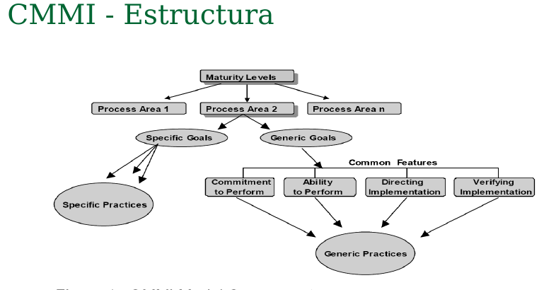
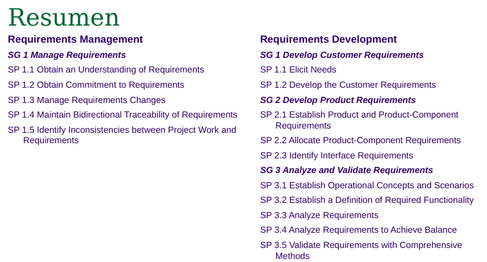
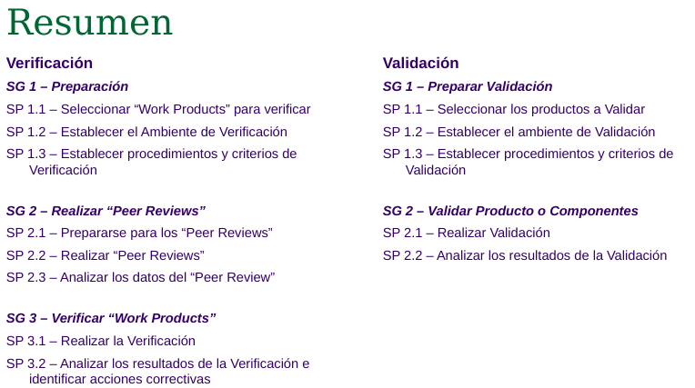
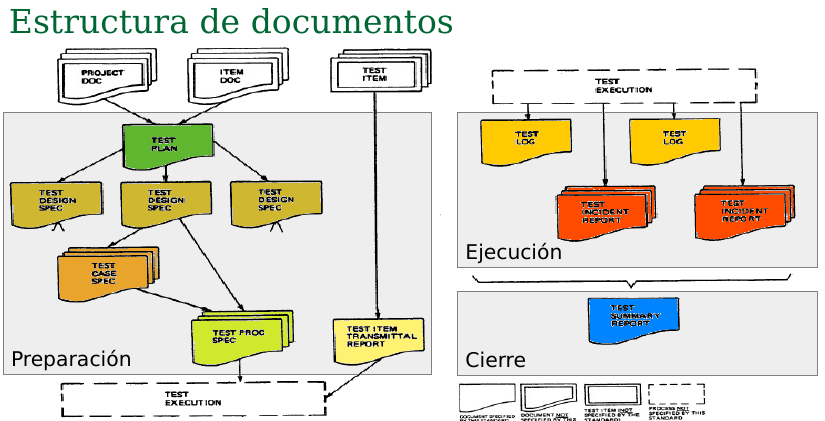
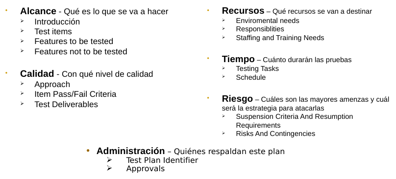
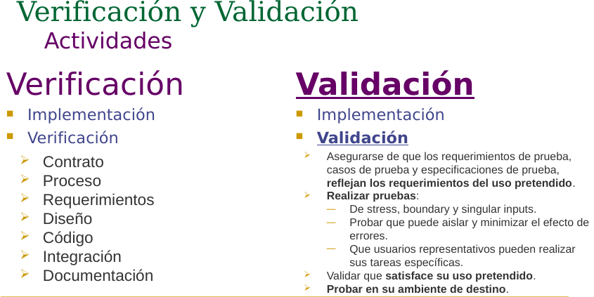
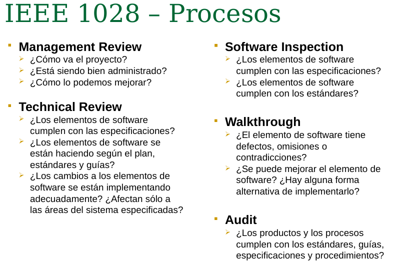

# Final aseguramiento
## Temas importantes
- Procesos del CMMI con sus specific goals
- Test Plan de la IEEE-829
---
## Introducción
### Qué es la calidad?
- CMMI
- IEEE 610
- ISO / IEC

### Desarrollar y Gestión de Requisitos
- Producto
- Stakeholders con expectativas
### Varificación y validación
- Evaluación

### Qué hacer?
- CMMI

### Cómo hacerlo?
- IEEE 12207: verificación y validación
- IEEE 1028: revisión de pares
- IEEE 829: documentación de testing
- Agile / Scrum: 

---
## CMMI
### Estructura

- Level 2: Requirement managment
- Level 3: Requirement development
- Nivel de madurez
  - Areas de proceso
    - Metas genéricas
    - Metas específicas

### Requirement managment
**Meta 1: Manage requirements**

Prácticas:
- 1.1 Entender los requerimientos
- 1.2 Obtain commitment to requirements
- 1.3 Manage requirements changes
- 1.4 Mantener trasabilidad bidireccional de los requerimientos
- 1.5 Identify inconsistencies between Project work and requirements

### Requirement development
**Meta 1: Develop customer requirements**
 
 Prácticas:
 - 1.1 Elicit needs
 - 1.2 Develop the customer requirements

**Meta 2: Develop product requirements**

Prácticas:
- 2.1 Establish product and product-component requirements
- 2.2 Allocate product-component requirements
- 2.3 Identify interface requirements

**Meta 3: Analyze and validate requirements**

Prácticas:
- 3.1 Definir el contexto operacional y escenario
- 3.2 Establish a definition of required functionality
- 3.3 Analyze requirements
- 3.4 Analyze requirements to achieve balance
- 3.5 Validate requeriments with comprehensive methods

---
## Requerimientos
### Formato
- Como [rol]
- Quisiera [funcionalidad]
- Tal que [valor para el negocio]
- Criterios de aceptación

Theme > Epic > User stories

### Requerimientos no funcionales
Done criteria

---
## CMMI (parte 2)
### Verificación y validación (nivel 3)

---
## IEEE 829 - Casos de prueba
### Formato:
- Id
- Test items
- Input
- Output
- Requerimientos del ambiente
- Procedimientos excepcionales
- Dependencias entre casos de prueba

### Tipos de tests
- Equivalence partitioning
- Boundary value analysis
- Error guessing
- Exploratoey testing
- Stress testing
- Regression testing
- Smoke testing
- Scenario testing
- Random testing
- Specification based
- Operationg test
- FullScale test
- Ergonomic test
- Configuration test

---
## IEEE 829 - Software test documentation

### Preparación
**Test plan**

**Especificación de diseño**: Bajada a detalle de lo que se especificó en el test plan
**Casos de prueba (Test case specification)**: Los casos de prueba de la IEEE 829

**Procedimiento**
- set-up
- start
- proceed
- measure
- shut down
- restart
- stop
- wrap up
- contingencies

**Transmisión de items**: Descripción de cada uno de los items que se entregan para ser testeados.

### Ejecución

**Test logs**: que cacos de prueba se ejecutaron, cuando se ejecutar y cuales fueron sus resultados.

**Reportes de incidentes**: todos los detalles del incidente

### Cierre
**Resumen**: Sintentiza toda la información del proceso de prueba realizado.

---

## Verificación y validación
### Niveles de testing
- Sistema
- Integración
- Unidad

### Técnicas
- Caja blanca
- Caja negra
- State based
  - Diseño por contrato
    - pre condiciones
    - post condiciones
    - invariantes
- Integración
  - Big bang
  - Incremental
- Sistema
  - User acceptance test

---
## IEEE 12207 Verificación y validación

---
## IEEE 1028 Software reviews and audits
- Elementos de software
- Revisión
- Auditoría

### Software inspection
**Roles:**
- Moderador
- Lector
- Recorder
- Inspector
- Autor

**Elementos:**
- Input
- Criterios de entrada
- Procedimientos
- Criterios de salida
- Output
- Auditabilidad
- Requerimientos de recoleccion de datos

---
## Scrum - Agile

### Agile manifesto
### Scrum
**Proceso básico**
- Product backlog
- Sprint backlog
- Iteration -> Sprint (2-4 weeks)
- Potentially shippable product increment

**Roles**
- Scrum master
- Product owner
- Scrum team
- Business owner
- Stakeholders

**Quién es el tester?** Puede haber alguien especializado
- Test driven development
- Acceptance test driven development
- Whole team testing
- Parallel independent testing
